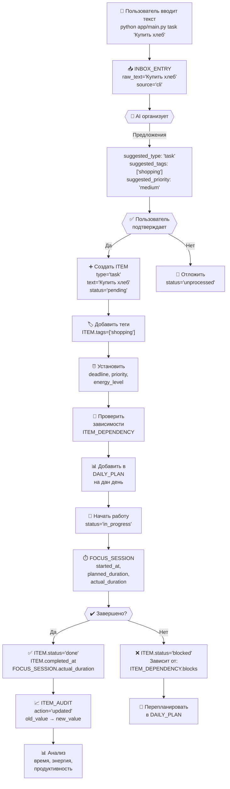
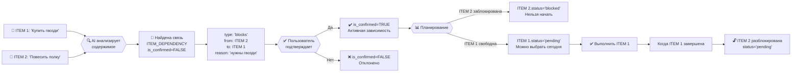
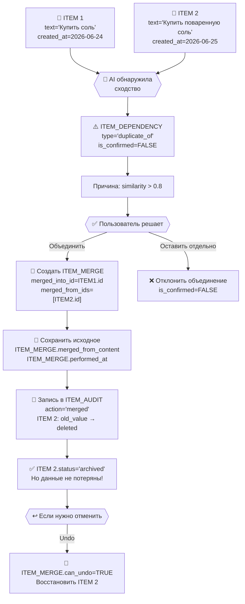
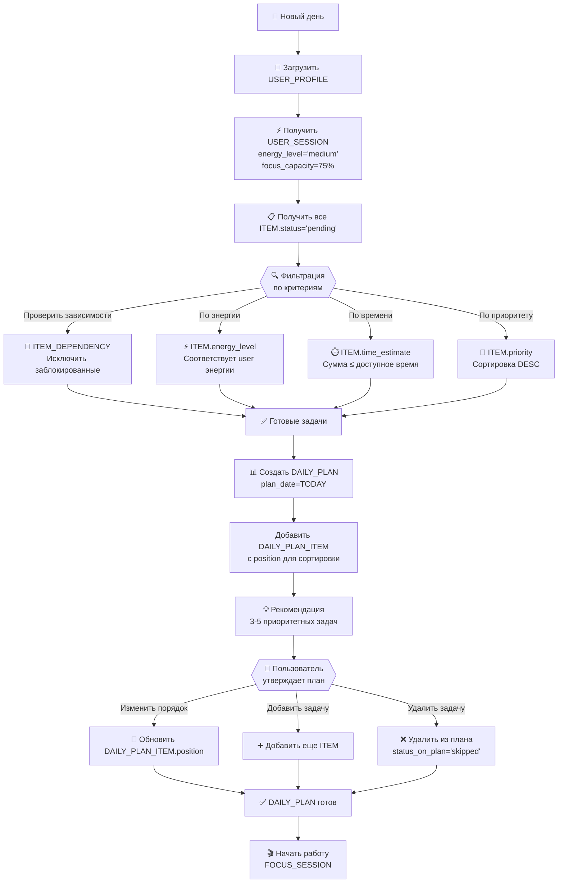
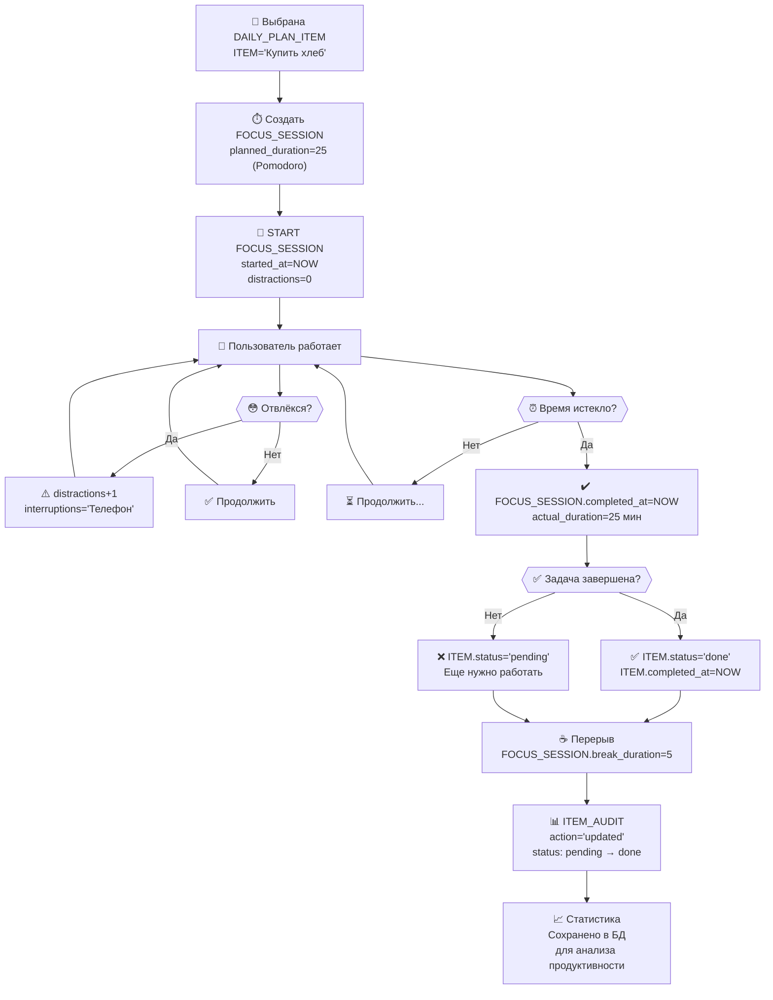
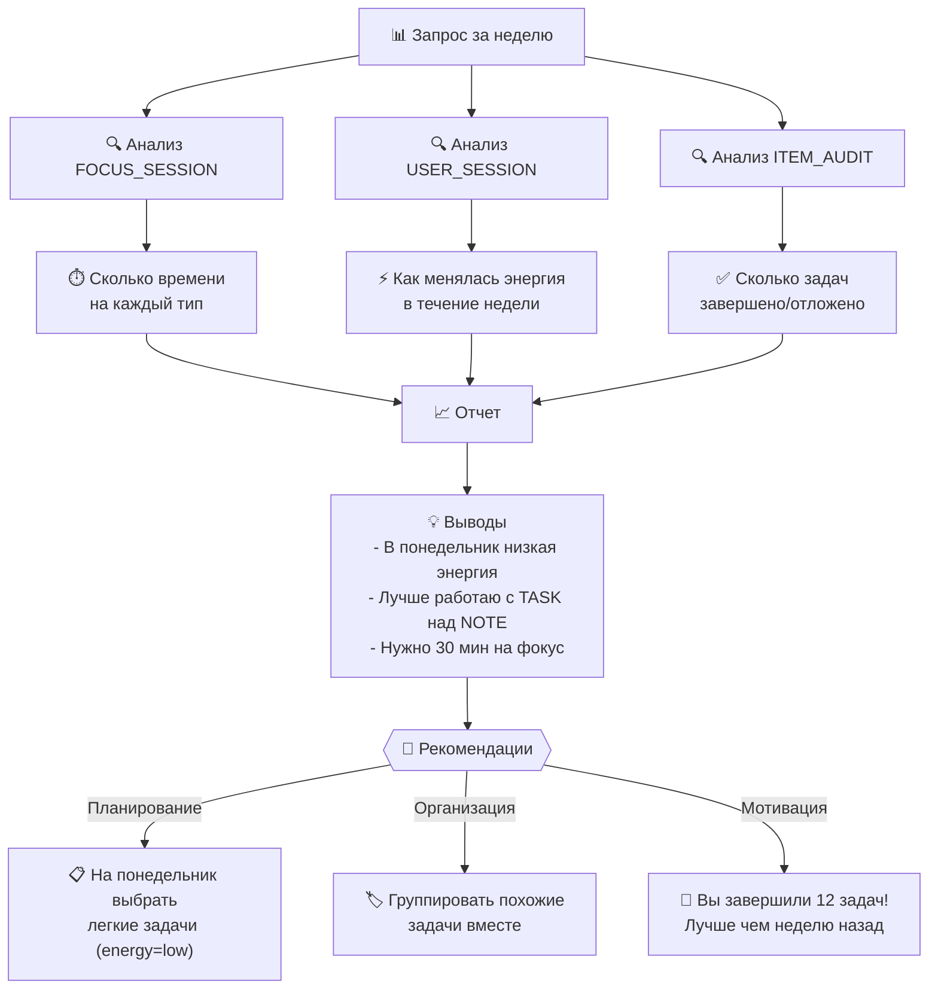

# Диаграммы потоков и взаимодействий

## 1. Жизненный цикл элемента (Item Lifecycle)



## 2. Выявление и управление зависимостями



## 3. Объединение дубликатов



## 4. Построение плана на день



## 5. Отслеживание прогресса (FOCUS_SESSION)



## 6. Анализ паттернов (Insights)



---

## Ключевые объекты и их роли

| Таблица | Роль | Когда используется |
|---------|------|-------------------|
| **INBOX_ENTRY** | Входящее | Первый захват, перед организацией |
| **ITEM** | Базовая единица | Всегда (все операции) |
| **ITEM_DEPENDENCY** | Выявление связей | Планирование, фильтрация, анализ |
| **ITEM_AUDIT** | История изменений | Откат, анализ, контроль качества |
| **ITEM_MERGE** | Объединение дубликатов | Очистка, организация |
| **DAILY_PLAN** | План на день | Каждый день, в начале |
| **FOCUS_SESSION** | Отслеживание работы | Во время выполнения задачи |
| **USER_SESSION** | Состояние пользователя | Планирование, адаптивные рекомендации |

---

## Примеры сценариев

### Сценарий 1: Быстрый захват без организации
```
1. пользователь: "Купить продукты"
2. CLI добавляет в INBOX_ENTRY
3. AI предлагает тип='task', теги=['shopping']
4. Пользователь: "Согласен"
5. ITEM создана и добавлена в DAILY_PLAN
6. Готово за 10 секунд ✅
```

### Сценарий 2: Выявление зависимостей
```
1. ITEM: "Повесить полку"
2. ITEM: "Купить гвозди"
3. AI: "Гвозди нужны для полки?"
4. Пользователь: "Да"
5. ITEM_DEPENDENCY: 2 блокирует 1
6. При планировании: сначала гвозди, потом полка ✅
```

### Сценарий 3: Объединение дубликатов
```
1. ITEM: "Купить молоко"
2. ITEM: "Молоко купить"
3. AI: "Это одно и то же?"
4. Пользователь: "Да, объедини"
5. ITEM_MERGE сохраняет обе версии
6. ITEM остается одна, но история не потеряна ✅
```

### Сценарий 4: Адаптивное планирование
```
1. USER_SESSION: energy_level='low', focus_capacity=40%
2. Доступно: 2 часа
3. AI выбирает:
   - ITEM priority='high', energy='low', time=30 мин
   - ITEM priority='medium', energy='low', time=90 мин
   - Исключает: priority='low', energy='high'
4. Результат: реалистичный план на день ✅
```
